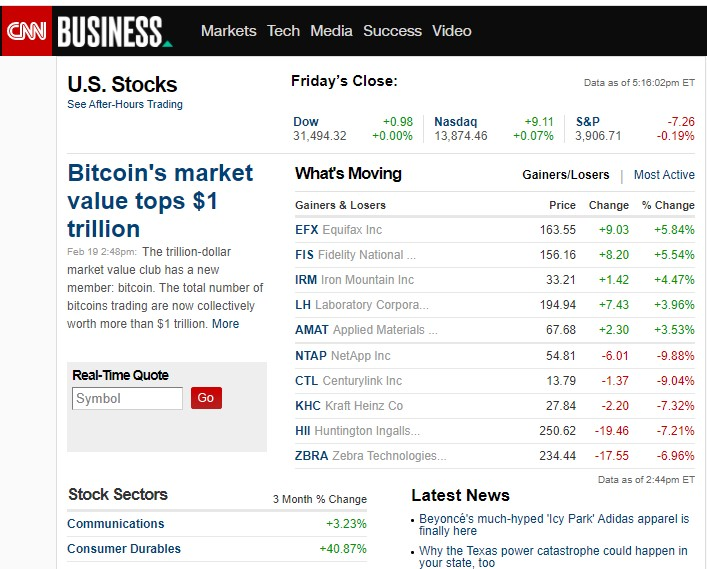
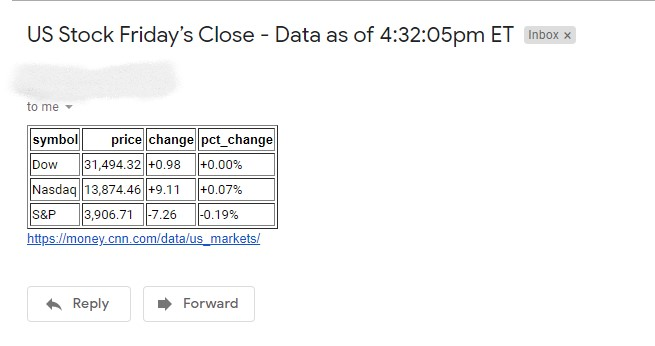
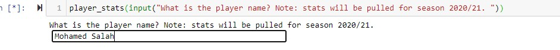
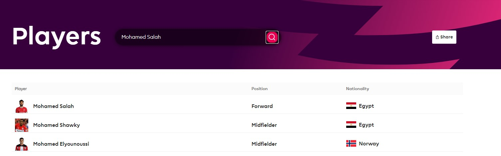
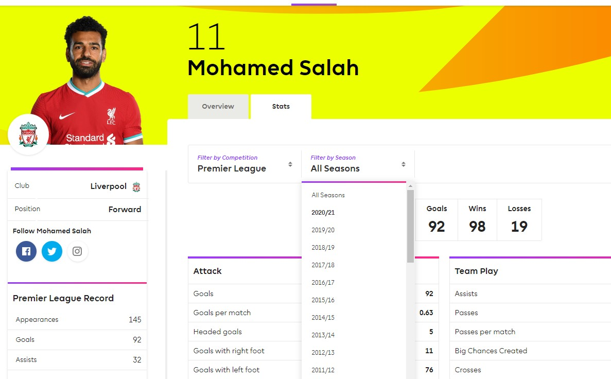
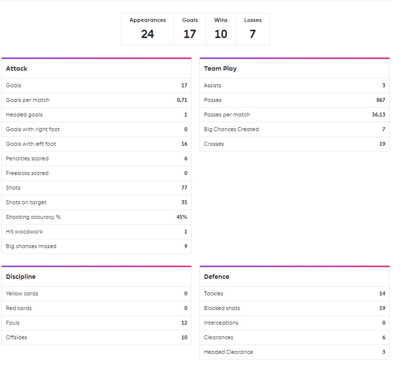
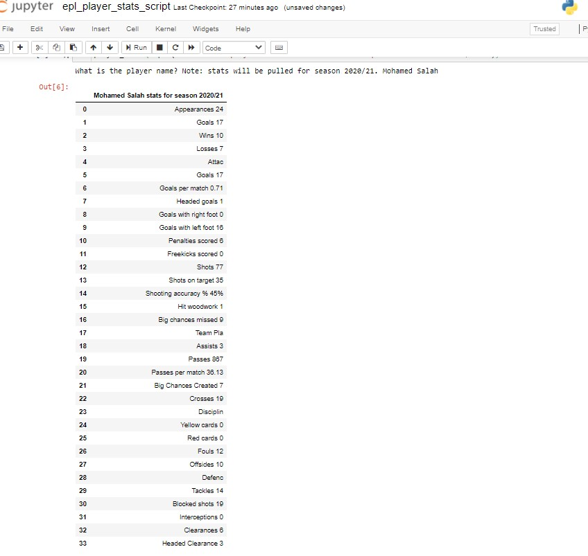

# Web Scraping

#### What is Web Scraping?

Web scraping, web harvesting, or web data extraction is data scraping used for extracting data from websites. The web scraping software may directly access the World Wide Web using the Hypertext Transfer Protocol or a web browser. For more info visit. https://en.wikipedia.org/wiki/Web_scraping 

## Project 1: Scraping stocks data and send scraped data to your inbox
Let's say you monitor stocks everyday and you want to check the day closing results by end of day and want it to be sent to your email. This script will do it for you.

Libraries: optional: [Selenium](https://chromedriver.chromium.org/getting-started) 
required : [Beautifulsoup](https://www.crummy.com/software/BeautifulSoup/bs4/doc/)
###### Note: In this app I used both libraries, but you can use Beautifulsoup only to load the targeted webpage. Selenium will be helpful with the website navigation. Project 2 will showcase. 

##### The script will scrape data from this webpage

##### Results will be sent to your inbox

#### Note: To automate this app, you can schedule the script using Windows Scheduler. For more info: https://datatofish.com/python-script-windows-scheduler/

## Project 2: Scraping your favorite English Premier League player stats

Libraries needed: [Selenium](https://chromedriver.chromium.org/getting-started) and [Beautifulsoup](https://www.crummy.com/software/BeautifulSoup/bs4/doc/)

This app will navigate through EPL website and scrape data for the player you picked.

##### The script will ask you to type the name of player you are intrested in (for our case I picked: Mohamed Salah)

##### Selenium's driver will navigate to the players page and search for the player (Mohamed Salah) and click on the name.

##### Navigate to the stats page and from the dropdown will pick season 2020/21.

##### This is what it will be scraped.

##### Finally, the app will return a stat summary for the player.

