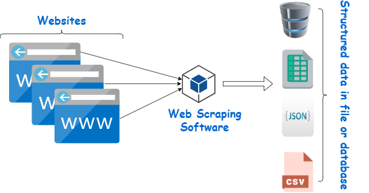

# Scraping-Dynamic-Web-Pages-with-Selenium

#### What is Web Scraping?

Web scraping, web harvesting, or web data extraction is data scraping used for extracting data from websites. The web scraping software may directly access the World Wide Web using the Hypertext Transfer Protocol or a web browser. https://en.wikipedia.org/wiki/Web_scraping 

## Case 1: Scrape stocks data from CNN US market Webpage and then send email with results to your inbox

The script will scrape data from this webpage

This will be sent to your inbox

